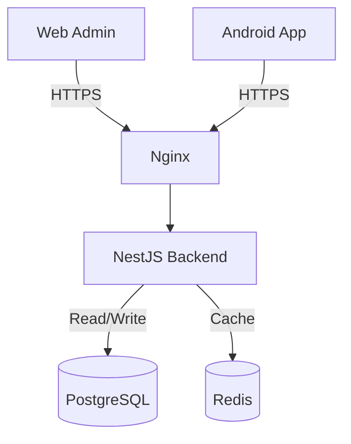

# System Architecture & Tech Stack

## 1. High-Level Architecture
The system follows a **Monolithic Repository (Monorepo)** pattern to ensure strict type safety and code sharing between the Web Portal and Mobile App.



## 2. Technology Stack

### 2.1 Backend (The Core)
*   **Framework**: **NestJS** (Node.js) - Modular, scalable, and follows Enterprise patterns.
*   **Language**: **TypeScript** (Strict Mode).
*   **Database**: **PostgreSQL** 16 (Relational integrity).
*   **ORM**: **Prisma** (Type-safe database access).
*   **Caching**: **Redis** (Session storage & high-speed counters).
*   **Security**:
    *   **Helmet**: Secure HTTP Headers.
    *   **Throttler**: Rate Limiting (DDoS protection).
    *   **Class-Validator**: Strict Input Whitelisting (prevents injection).
    *   **Argon2id**: Industry-standard password hashing.

### 2.2 Web Admin Portal
*   **Framework**: **Next.js 14** (App Router).
*   **Styling**: **Vanilla CSS Modules** with a Custom Design System (Emerald Green Theme).
*   **State Management**: React Server Components (Server) + Context API (Client).
*   **Features**: Real-time dashboards, Role-Based Access Control (RBAC).

### 2.3 Android Application
*   **Framework**: **React Native (Expo)**.
*   **Type**: **Online-Only** (Secure Client).
*   **Data Handling**: Zero-Persistence (RAM only) for maximum security on lost devices.

## 3. Directory Structure
```text
d:/Projects/Intern/
├── apps/
│   ├── api/            # NestJS Backend
│   ├── web/            # Next.js Admin Portal
│   └── mobile/         # React Native Sales App
├── packages/
│   └── dto/            # Shared Data Transfer Objects
├── docker-compose.yml  # Local Development Infrastructure
└── SECURITY.md         # Security Protocols
```

## 4. Security Measures (Implemented)
*   **Strict CORS**: Configured to block unauthorized domains.
*   **Input Sanitization**: Global Validation Pipe enabled.
*   **Docker Isolation**: Database is isolated in a private network.
